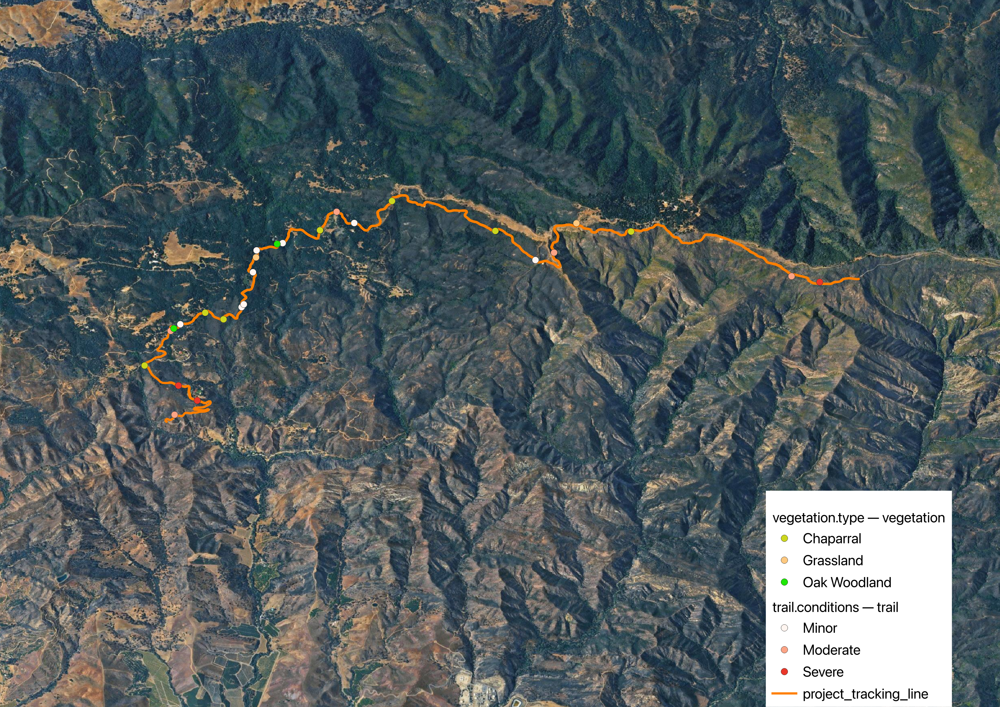

# Refugio Pass Estate Management & Hospitality Reference Map
**Comprehensive Field Audit Portfolio | 16.2-Mile Operations & Guest Experience Proof-of-Concept**

## Executive Summary
This independent project serves as a premium commercial proof-of-concept for high-end private estates, multi-acre ranches, and luxury wineries looking to optimize their spatial asset management and elevate their guest experiences. Utilizing a 16.2-mile backcountry footprint along Refugio Pass (Santa Ynez Mountains), this project demonstrates an end-to-end framework for mobile data acquisition, interactive asset tracking, and ecological resource mapping.

## What My Maps Can Do for Your Property

This project is a **working demonstration** — proof that raw field data can become a polished, interactive map that works beautifully alongside guided tours. The specific points here (vegetation, trail conditions) were collected on a hike to show the process end-to-end. But the same approach applies to whatever matters on **your** property.

### A Richer Guided Experience

When a guest joins a tour, they can follow along on their phone as your team leads them. As you pass each stop, they tap the point and see a description, a photo, a story — the vineyard block they're standing in front of, the varietal and planting year, tasting notes, a heritage oak, a viewpoint. It turns a walk into something guests can revisit and share long after the tour ends. The map can be shown on a screen in a tasting room to highlight the route and encourage interest, embedded on your website to give visitors a sneak peek at the experience, and used as a reference for guests during guided tours.

### What the Points Can Be, Tailored to You

- **Vineyard blocks** — varietal, planting year, tasting notes for each stop on the tour
- **Terroir & habitat zones** — native boundaries, shaded spots, wildlife areas worth pointing out
- **Tasting & experience stops** — overlooks, olive groves, picnic spots your guides route through
- **Tour routes** — the exact path your team walks, mapped so guests can follow along

### Behind the Scenes, It Keeps Operations Safe

The same map can carry hazard and maintenance data (erosion, downed trees, blocked access) so crews know exactly where to go — keeping guest routes safe without the work ever being visible.

## Spatial Visualization
Below is the finalized premium estate layout displaying the 16.2-mile trail network corridor, categorized ecological assets, and structural preservation priorities overlaid on high-resolution global satellite imagery.

**Interactive Map**: With descriptions and photos.
<iframe src="https://owensylvia.github.io/Avenza-QGIS-Field-Mapping/" width="100%" height="500" style="border:none;"></iframe>

## Commercial Value Metrics (KPIs)
* **Total Audited Footprint:** 16.2 Miles of Continuous Spatial Field Tracking
* **Resource Assessment Locales:** Discrete point features logging botanical zones and pathway infrastructure.
* **Data Standards:** Non-Proprietary Open-Source Web-Optimized GeoJSON.

## Operational Methodology & Field Implementation
1. **Mobile Data Capture:** Spatial tracking paths and asset vectors were mapped dynamically on-the-ground using advanced mobile GPS data collectors while navigating the terrain.
2. **System Integration:** Raw spatial vector information was exported as a unified data packet and integrated into a professional desktop GIS suite (**QGIS 3.44 LTR**) for data isolation, validation, and styling.
3. **Web Optimization:** Coordinates were scrubbed and packaged into lightweight GeoJSON structures to ensure the maps can load seamlessly on standard mobile browsers, estate tablets, or via tasting room QR codes.
4. **Cartographic Georeferencing:** Property vectors were perfectly aligned and georeferenced over projected high-resolution satellite imagery, verifying real-world accuracy down to individual canopy and pathway boundaries.

## Digital Asset Deliverables Folder
* `Refugio_Tracking_Line.geojson` - Main infrastructure vector path detailing 16.2 miles of exact continuous trail/road placement, track data, and 3D elevation slope values.
* `vegetation.type.geojson` - Categorized botanical point file mapping estate habitat zones, vineyard expansions, and fuel clearance zones.
* `trail.conditions.geojson` - Structural risk ledger tracking specific operational hazards and maintenance locations.
* `Final_Map_output.png` - High-resolution printable presentation document designed for tasting room displays or executive operational briefs.
* `.gitignore` - System configuration file ensuring messy temporary local software data remains hidden from the clean public repository.
